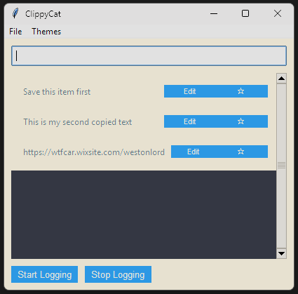
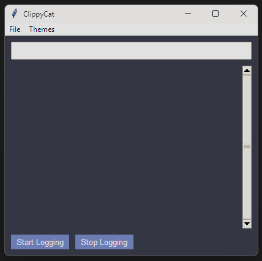
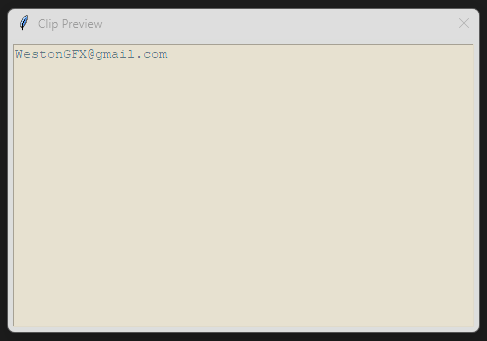
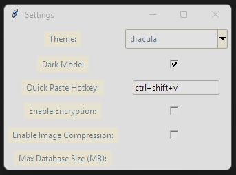

# ClippyCat - A Lightweight Clipboard Manager

ClippyCat is a lightweight and feature-rich clipboard manager designed to help you track, organize, and manage your clipboard history. With a modern GUI, support for text and images, and advanced features like search, tagging, and favorites, ClippyCat is the perfect tool for anyone who frequently works with copied content.

## Features

- **Clipboard History**: Automatically logs clipboard content (text and images) for easy access.
- **Search Functionality**: Quickly find clipboard items using a search bar. *(Note: Search feature is not yet implemented)*
- **Favorites**: Mark important clipboard items as favorites for quick access.
- **Tags and Categories**: Organize clipboard items with tags.
- **Modern UI**: A clean and responsive interface with light and dark themes.
- **Hotkey Support**: Use customizable hotkeys for quick actions like pasting or toggling the app.
- **SQLite Storage**: Stores clipboard history in a local SQLite database for persistence.
- **Duplicate Detection**: Prevents duplicate clipboard entries.
- **Preview**: Displays a preview of clipboard content in the GUI.
- **Image Support**: Logs and previews images copied to the clipboard.
- **Export/Import**: Save and load clipboard history for backup or sharing.
- **Tray Icon**: Runs in the system tray for easy access and minimal interruption.
- **Customizable Themes**: Offers a variety of themes to suit your preferences.


## Current Limitations

Please be aware of the following current limitations:

- **Search Functionality**: The search feature is not yet implemented.
- **Clipboard Item Removal**: The ability to delete clipboard items is not yet implemented.
- **Logging Activation**: Clipboard monitoring must be manually started using the "Start Logging" button.

## Screenshots

Explore ClippyCat's interface through these screenshots: *(Note: If images don't appear on GitHub, ensure they've been committed and pushed to the repository)*
| Light Theme | Dark Theme |
|---|---|
|  |  |
| *Clean interface with light color scheme* | *Dark mode for comfortable nighttime use* |

| Clip Editor | Settings Panel |
|---|---|
|  |  |
| *Detailed clip management interface* | *Customization and preference controls* |

## Project Structure

```
clipboard_logger_gui
├── src
│   ├── main.py              # Entry point of the application
│   ├── clipboard_handler.py  # Handles clipboard operations
│   ├── gui.py               # Contains the GUI implementation
│   ├── themes.py            # Defines the available themes
│   └── clippycat_icon.png   # Icon file for the application
├── config
│   └── config.ini           # Configuration file for settings
├── README.md                # Documentation for the project
├── requirements.txt         # List of dependencies
└── clipboard.db             # SQLite database for clipboard history (auto-generated)
```

## Installation

1. **Clone the Repository**:
   ```bash
   git clone <repository-url>
   cd clipboard_logger_gui
   ```

2. **Install Dependencies**:
   Ensure you have Python 3.7+ installed. Then, run:
   ```bash
   pip install -r requirements.txt
   ```

3. **Configure the Application**:
   Edit the `config/config.ini` file to customize settings such as maximum clipboard size, hotkeys, UI preferences, and database size.

4. **Run the Application**:
   ```bash
   python src/gui.py
   ```

## Usage

1. **Start Logging**:
   - Launch the application. It will start in the system tray.
   - To start monitoring the clipboard, **you must click the "Start Logging" button** in the GUI.
   - The clipboard content will then be logged and displayed in the GUI.
   - To stop monitoring, click the "End Logging" button.

2. **Managing Clipboard Items**:
   - Click on any saved clipboard item in the list to open the editor and modify its content.
   - Note: The ability to remove clipboard items is not yet implemented.
   - Note: The search functionality is not yet implemented.

3. **Quick Paste**:
   - Use the hotkey `Ctrl+Shift+V` to open the quick paste menu.

4. **Settings**:
   - Access settings from the **File menu** to customize themes, hotkeys, encryption, and more.
   - The settings panel allows you to configure various aspects of the application.

5. **Editing Saved Items**:
   - To edit a saved clipboard item, click on it in the main interface to open the clip editor.
   - Make your changes and save to update the stored clipboard item.

6. **Tray Icon**:
   - Right-click the tray icon to access the menu with options to open the app or exit.

## Dependencies

- **Python Libraries**:
  - `pyperclip`: For clipboard access.
  - `tkinter`: For the graphical user interface.
  - `sqlite3`: For storing clipboard history.
  - `keyboard`: For hotkey support.
  - `ttkthemes`: For modern UI themes.
  - `Pillow`: For handling image clipboard content.
  - `pystray`: For system tray icon functionality.
  - `cryptography`: For content encryption.

Install these dependencies using the `requirements.txt` file.

## Themes

ClippyCat comes with a variety of built-in themes:

- Default
- Dark
- Pastel
- Retro
- High Contrast
- Monokai
- Solarized Light
- Solarized Dark
- Gruvbox Light
- Gruvbox Dark

You can switch between themes in the Settings menu.

## License

This project is licensed under the MIT License. See the LICENSE file for more details.

## Contributing

We welcome contributions! If you'd like to contribute, please fork the repository, make your changes, and submit a pull request. For major changes, please open an issue first to discuss what you'd like to change.

---

Thank you for using ClippyCat! If you have any questions or feedback, feel free to open an issue or contact us.